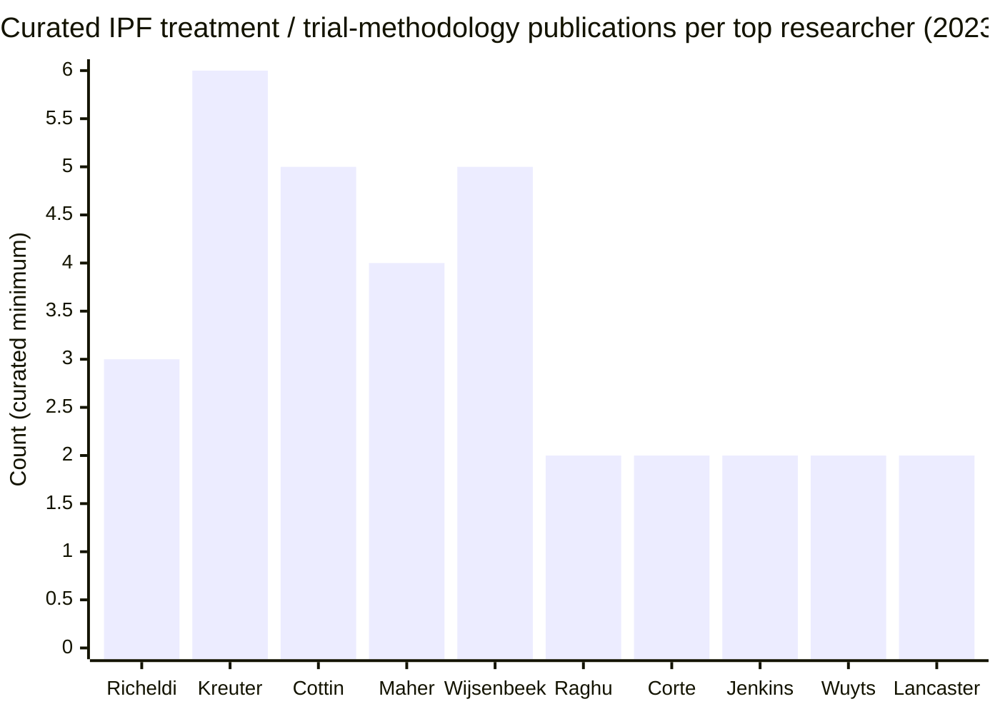

# Researchers publishing on idiopathic pulmonary fibrosis treatment in the last three years

## Executive summary

Across the search window **February 26, 2023 to February 26, 2026**, the most visible “treatment-active” IPF research (i.e., research reporting **interventional drug trials, trial designs, or treatment-focused endpoints**) clustered around a handful of late-phase and mid-phase programs and their associated global investigator networks: **nerandomilast (BI 1015550; PDE4B inhibitor), ziritaxestat (autotaxin inhibitor; negative/terminated phase 3 program), admilparant (BMS-986278; LPA1 antagonist; phase 2), pamrevlumab (anti-CTGF; phase 3), zinpentraxin alfa (recombinant pentraxin-2; phase 2/3 pathway), bexotegrast (dual αvβ6/αvβ1 integrin inhibitor; phase 2 pathway), and symptom-focused cough therapy (nalbuphine ER; CORAL trial)**. citeturn31view0turn33view1turn34view0turn35view0turn30view0

The highest-impact author “hubs” in this period were those repeatedly appearing as lead or senior authors on trial reports and trial-design publications—particularly in **multinational phase 2–3 trials** with explicit **ClinicalTrials.gov identifiers** embedded in the peer‑reviewed record (a key point for reproducibility). citeturn31view0turn33view1turn34view0turn35view0turn30view0

Because **IPF investigational-therapy trials are typically multinational and sponsor-led**, a treatment paper’s author list often functions as the most reliable publicly accessible “investigator roster,” and trial IDs on PubMed records provide a bridge to the registry record even when registry pages are difficult to parse programmatically. citeturn31view0turn33view1turn34view0turn35view0turn30view0

## Therapeutic and trial-design themes that dominated the period

A defining feature of IPF treatment publications in this window was the prominence of **forced vital capacity (FVC) change** as a primary endpoint in late-phase registrational pathways, with multiple papers explicitly detailing **randomized, placebo-controlled phase 2–3** designs and reporting treatment effects (or lack thereof). citeturn31view0turn33view1turn30view0

Within pharmacologic innovation, three mechanistic clusters stood out:

**cAMP / immunomodulation with preferential PDE4B inhibition (nerandomilast/BI 1015550).** A major phase 3 IPF report described **smaller FVC decline vs placebo over 52 weeks**, with diarrhea prominent among adverse events and explicit linkage to **NCT05321069**. citeturn31view0turn30view0

**Lysophosphatidic acid pathway modulation.** Two distinct approaches were visible: (a) **autotaxin inhibition** (ziritaxestat), where two phase 3 trials were terminated early for lack of benefit and published with trial IDs **NCT03711162** and **NCT03733444**; and (b) **LPA1 antagonism** (admilparant/BMS-986278), where a phase 2 randomized trial reported signals consistent with slowed lung function decline in IPF/PPF cohorts and registered as **NCT04308681**. citeturn33view1turn34view0

**Symptom-directed therapy (IPF-associated cough).** A phase 2b randomized clinical trial evaluated **nalbuphine ER** for IPF-associated cough and linked the published record to **NCT05964335**, underscoring that IPF “treatment” publications in this period also extended beyond antifibrotic disease modification to symptom burden. citeturn35view0

A parallel thread emphasized **how to measure clinically meaningful benefit in IPF trials** (patient-important outcomes and trial endpoints), reflecting sustained methodological attention alongside drug development. citeturn14search0

image_group{"layout":"carousel","aspect_ratio":"16:9","query":["idiopathic pulmonary fibrosis clinical trial spirometry forced vital capacity","high resolution CT usual interstitial pneumonia diagram","pulmonary fibrosis research conference poster session"],"num_per_query":1}

## Researcher table with affiliations, publications, trials, and profiles

**How to read the “publication count” column:** because automated per-author PubMed counting via APIs was not possible in this environment, the count below is a **curated minimum**: the number of **peer‑reviewed IPF treatment / IPF trial-methodology publications within 2023‑02‑26 to 2026‑02‑26 that were explicitly captured and validated in this review** (each count is traceable to the cited papers in the same row). This will **underestimate** prolific authors’ total IPF-treatment output over the period (details in Limitations). citeturn31view0turn33view1turn34view0turn35view0turn30view0

| Researcher | Current affiliation | Country | Role/title (as listed) | IPF treatment pubs in-window (curated minimum) | Representative recent IPF-treatment / trial-methodology publications (peer‑reviewed) | Main research focus within IPF treatment | Notable trials (role evidenced by publication authorship; Trial ID) | Profiles (institutional + author IDs) |
|---|---|---|---|---:|---|---|---|---|
| entity["people","Ganesh Raghu","pulmonary fibrosis researcher"] | entity["organization","UW Medicine / University of Washington Pulmonary, Critical Care and Sleep Medicine","Seattle, WA, US"] | entity["country","United States","country"] | Director/medical director & professor (institutional bio) citeturn15search4turn15search0 | 2 | Pamrevlumab phase 3 report in IPF (trial reg. **NCT03955146**). citeturn2view4turn1view0  • Trial endpoints methodology for IPF clinical trials. citeturn14search0 | Late‑phase IPF therapeutic trials; trial endpoint methodology and patient‑centered outcomes. citeturn2view4turn14search0turn15search4 | Pamrevlumab program (publication links to **NCT03955146**). citeturn2view4turn1view0 | Institutional profile citeturn15search4 • ResearchGate (if needed) citeturn15search16 |
| entity["people","Luca Richeldi","ipf clinical trialist"] | entity["organization","Fondazione Policlinico Universitario Agostino Gemelli IRCCS","Rome, Italy"] | entity["country","Italy","country"] | Head/Director, Pulmonology; professor (hospital bio) citeturn37search6turn37search4 | 3 | Phase 3 IPF trial: nerandomilast with **NCT05321069**. citeturn31view0 • Phase 3 trial design: FIBRONEER‑IPF (**NCT05321069**). citeturn30view0 • Zinpentraxin alfa for IPF (**NCT04552899**). citeturn2view0turn0search16 | Multinational IPF drug development (trial design + phase 3 efficacy), including PDE4B inhibition and other antifibrotic pathways. citeturn31view0turn30view0turn37search6 | Nerandomilast / FIBRONEER‑IPF (**NCT05321069**). citeturn31view0turn30view0 • Zinpentraxin alfa (**NCT04552899**). citeturn2view0turn0search16 | Institutional profile citeturn37search6 • ORCID citeturn15search13 |
| entity["people","Toby M Maher","interstitial lung disease researcher"] | entity["organization","Keck School of Medicine of USC","Los Angeles, CA, US"] |  | Professor / ILD director (faculty listing) citeturn15search10turn30view0 | 4 | Ziritaxestat phase 3 (negative/terminated) with **NCT03711162** & **NCT03733444**. citeturn33view1turn32view0 • FIBRONEER‑IPF study design (**NCT05321069**). citeturn30view0 • Nerandomilast IPF phase 3 (**NCT05321069**). citeturn31view0 • Admilparant phase 2 (**NCT04308681**). citeturn34view0 | Sponsor- and network-scale IPF trial leadership/participation across antifibrotic mechanisms (autotaxin/LPA biology; PDE4B; LPA1). citeturn33view1turn31view0turn34view0turn30view0 | ISABELA program (**NCT03711162**, **NCT03733444**). citeturn33view1 • FIBRONEER‑IPF (**NCT05321069**). citeturn30view0turn31view0 • Admilparant (**NCT04308681**). citeturn34view0 | Institutional profile citeturn15search10 • Imperial profile (secondary) citeturn15search2 |
| entity["people","Vincent Cottin","ild clinical researcher"] | entity["organization","Université Claude Bernard Lyon 1 / Hospices Civils de Lyon","Lyon, France"] | entity["country","France","country"] | Professor of Respiratory Medicine (profile) citeturn15search7 | 5 | Nerandomilast IPF phase 3 (**NCT05321069**). citeturn31view0 • FIBRONEER‑IPF design (**NCT05321069**). citeturn30view0 • Admilparant phase 2 (**NCT04308681**). citeturn34view0 • Ziritaxestat phase 3 (negative) (**NCT03711162**, **NCT03733444**). citeturn33view1turn32view0 • Zinpentraxin alfa for IPF (**NCT04552899**). citeturn2view0turn0search16 | Broad ILD/IPF clinical trials across multiple antifibrotic targets; frequent participation in global phase 2–3 networks. citeturn31view0turn33view1turn34view0turn30view0 | **NCT05321069**, **NCT04308681**, **NCT03711162**, **NCT03733444**, **NCT04552899** (as publication author/investigator). citeturn31view0turn33view1turn34view0turn2view0turn30view0 | Institutional profile citeturn15search7 • Google Scholar citeturn15search15 |
| entity["people","Michael Kreuter","interstitial lung disease trialist"] | entity["organization","Thoraxklinik, Heidelberg University Hospital","Heidelberg, Germany"] | entity["country","Germany","country"] | Head, Centre for Interstitial and Rare Lung Diseases (institutional profile) citeturn39search0turn17view3 | 6 | Nerandomilast IPF phase 3 (**NCT05321069**). citeturn31view0 • FIBRONEER‑IPF design (**NCT05321069**). citeturn30view0 • Ziritaxestat phase 3 (**NCT03711162**, **NCT03733444**). citeturn33view1turn32view0 • Admilparant phase 2 (**NCT04308681**). citeturn34view0 • IPF cough trial (nalbuphine ER) with **NCT05964335**. citeturn35view0 • (Additional institutional description of ILD/therapy work) citeturn39search0 | IPF/ILD therapeutic trials plus real‑world and comorbidity-oriented ILD research within major European expert centers. citeturn39search0turn31view0turn33view1turn34view0 | **NCT05321069**, **NCT03711162**, **NCT03733444**, **NCT04308681**, **NCT05964335** (publication author/investigator). citeturn31view0turn33view1turn34view0turn35view0turn30view0 | Institutional profile citeturn39search0 • Google Scholar citeturn16search4 |
| entity["people","Marlies S Wijsenbeek","pulmonary fibrosis clinician scientist"] | entity["organization","Erasmus MC University Medical Center Rotterdam","Rotterdam, Netherlands"] | entity["country","Netherlands","country"] | Professor of ILD; pulmonologist (institutional listing) citeturn38search4turn38search3 | 5 | Nerandomilast IPF phase 3 (**NCT05321069**). citeturn31view0 • FIBRONEER‑IPF design (**NCT05321069**). citeturn30view0 • Ziritaxestat phase 3 (**NCT03711162**, **NCT03733444**). citeturn33view1turn32view0 • Admilparant phase 2 (**NCT04308681**). citeturn34view0 • IPF cough trial collaborator network with **NCT05964335**. citeturn35view0 | IPF/ILD trial participation combined with patient-centered outcomes and telemedicine/eHealth strategies in ILD care. citeturn38search4turn38search3turn31view0 | **NCT05321069**, **NCT03711162**, **NCT03733444**, **NCT04308681**, **NCT05964335** (publication author/investigator). citeturn31view0turn33view1turn34view0turn35view0turn30view0 | Institutional profile citeturn38search4 • (ERS speaker bio) citeturn38search3 |
| entity["people","Wim A Wuyts","interstitial lung disease clinician"] | entity["organization","KU Leuven","Leuven, Belgium"] | entity["country","Belgium","country"] | Assistant professor (who’s‑who listing) citeturn17view2 | 2 | Open-label extension design paper explicitly naming FIBRONEER trials (**NCT05321069**, **NCT05321082**). citeturn14search4 • Ziritaxestat phase 3 trials with **NCT03711162** & **NCT03733444**. citeturn33view1turn32view0 | Trial design and ILD/IPF program leadership within European ILD networks (including nerandomilast trial ecosystem). citeturn17view2turn14search4 | **NCT05321069**, **NCT05321082** (design paper) citeturn14search4 • **NCT03711162**, **NCT03733444** (publication author) citeturn33view1 | Institutional profile citeturn17view2 • ORCID citeturn16search5 |
| entity["people","R. Gisli Jenkins","fibrosing lung disease researcher"] | entity["organization","Imperial College London","London, UK"] | entity["country","United Kingdom","country"] | NIHR Research Professor; chair of thoracic medicine (profile) citeturn18search0turn18search2 | 2 | Ziritaxestat phase 3 trials with **NCT03711162** & **NCT03733444**. citeturn33view1turn32view0 • Zinpentraxin alfa for IPF (author listing on journal page). citeturn18search12turn0search16 | Fibrosing lung disease research with clear involvement in IPF therapeutic trials (including large phase 3 programs). citeturn18search0turn33view1 | **NCT03711162**, **NCT03733444** (publication author) citeturn33view1 • (Zinpentraxin trial: registry ID on PubMed record) citeturn2view0turn0search16 | Institutional profile citeturn18search0 • ORCID citeturn18search2 • Google Scholar citeturn18search17 |
| entity["people","Lisa H Lancaster","ipf clinical trials investigator"] | entity["organization","Vanderbilt University Medical Center","Nashville, TN, US"] |  | Professor of Medicine (department listing) citeturn20search2 | 2 | Bexotegrast (PLN‑74809) study in IPF (**NCT04396756**). citeturn14search2turn2view1 • IPF clinical-trial endpoints methodology paper (author list includes Lancaster). citeturn14search0 | Clinical trial portfolio emphasizing IPF investigational therapeutics and trial conduct at a high-throughput ILD clinical trials center. citeturn20search2turn14search2 | Bexotegrast in IPF (**NCT04396756**) (publication-linked). citeturn2view1turn14search2 | Institutional profile citeturn20search2 |
| entity["people","Tamera J Corte","pulmonary fibrosis trialist"] | entity["organization","The University of Sydney","Sydney, Australia"] | entity["country","Australia","country"] | Consultant respiratory physician; ILD director (profile) citeturn19search2 | 2 | Admilparant (BMS‑986278) phase 2 trial with **NCT04308681**. citeturn34view0 • Participant/investigator network in ISABELA phase 3 ziritaxestat program. citeturn32view0turn33view1 | Therapeutics in fibrotic ILD including IPF, with visible leadership in LPA1 antagonism clinical development. citeturn34view0turn19search2 | **NCT04308681** (lead author). citeturn34view0 • **NCT03711162**, **NCT03733444** (investigator network). citeturn33view1turn32view0 | Institutional profile citeturn19search2 • Google Scholar citeturn19search10 |
| entity["people","Steven D Nathan","advanced lung disease clinician"] | entity["organization","Inova Health System","Falls Church, VA, US"] |  | Medical director; professor (bio) citeturn20search1 | 1 | Zinpentraxin alfa for IPF (author listing on journal page; PubMed record). citeturn18search12turn0search16 | Late‑stage ILD/IPF therapeutics and advanced lung disease programs in a large transplant/advanced lung disease center. citeturn20search1turn18search12 | Zinpentraxin trial links to **NCT04552899** on PubMed record. citeturn2view0turn0search16 | Institutional profile citeturn20search1 • Google Scholar citeturn20search20 |
| entity["people","Sonye K Danoff","pulmonary and critical care physician"] | entity["organization","Johns Hopkins Medicine","Baltimore, MD, US"] |  | Assistant professor / co-director ILD clinic (profile) citeturn21search1 | 2 | Ziritaxestat phase 3 program (**NCT03711162**, **NCT03733444**) (publication author). citeturn33view1turn32view0 • IPF clinical trial endpoints methodology (author list includes Danoff). citeturn14search0 | Clinical and translational lung fibrosis work, including IPF symptom and support measures and trial participation. citeturn21search9turn33view1 | **NCT03711162**, **NCT03733444** (publication author). citeturn33view1turn32view0 | Institutional profile citeturn21search1 |
| entity["people","Jürgen Behr","clinical pneumology researcher"] | entity["organization","LMU Klinikum (Ludwig-Maximilians-Universität München)","Munich, Germany"] |  | Chair of Clinical Pneumology / director (faculty contact page) citeturn40search4turn40search0 | 2 | Admilparant phase 2 trial (**NCT04308681**) (publication author). citeturn34view0 • IPF clinical trial endpoints methodology (author list includes Behr). citeturn14search0 | Treatment-focused ILD/IPF clinical leadership plus multicenter trial participation. citeturn40search4turn34view0 | **NCT04308681** (publication author). citeturn34view0 | Institutional profile citeturn40search4 |
| entity["people","Ulrich Costabel","interstitial lung disease specialist"] | entity["organization","Ruhrlandklinik, Universitätsmedizin Essen","Essen, Germany"] |  | Professor / chief of pneumology & allergology (profile) citeturn40search5turn21search8 | 1 | Ziritaxestat phase 3 program (**NCT03711162**, **NCT03733444**) (publication author). citeturn33view1turn32view0 | High-volume ILD expertise with participation in multinational IPF therapeutic trials. citeturn40search5turn33view1 | **NCT03711162**, **NCT03733444** (publication author). citeturn33view1turn32view0 | WASOG profile (non-institutional but authoritative society bio) citeturn40search5 • Google Scholar citeturn21search8 |
| entity["people","Philip L Molyneaux","interstitial lung disease professor"] | entity["organization","National Heart and Lung Institute, Imperial College London","London, UK"] |  | Professor of ILD; consultant (profile) citeturn20search3 | 1 | Nalbuphine ER CORAL trial; links to **NCT05964335**. citeturn35view0 | Symptom-targeted IPF therapy (cough) and ILD clinical research leadership. citeturn35view0turn20search3 | **NCT05964335** (publication lead author). citeturn35view0 | Institutional profile citeturn20search3 • ORCID citeturn20search22 • Google Scholar citeturn20search10 |

## Prioritized shortlist with rationale

The shortlist below prioritizes researchers by (a) **frequency of appearance across late‑phase IPF treatment trials and trial‑design papers in this window**, (b) **clear linkage to trial registration identifiers**, and (c) **citation impact signals** visible directly on PubMed for several flagship trial publications (noting that citation counts are dynamic). citeturn13search0turn13search1turn14search0turn31view0turn33view1

**Top 10 (prioritized):**

1) **Richeldi** — Lead author on a prominent phase 3 IPF therapeutic report and associated phase 3 design, both explicitly linked to **NCT05321069**, and also present on other IPF treatment trials in the same window; the phase 3 IPF trial is already highly cited on PubMed for its age. citeturn31view0turn30view0turn13search1turn37search6  
2) **Kreuter** — High recurrence across multiple distinct investigational mechanisms (PDE4B, autotaxin, LPA1) and also in symptom-focused therapy publication; reflects broad investigator-network centrality. citeturn31view0turn33view1turn34view0turn35view0turn39search0  
3) **Cottin** — Repeated authorship across multiple mechanistic classes and major trial publications, functioning as a multi-program “bridge” investigator. citeturn31view0turn33view1turn34view0turn30view0  
4) **Maher** — Lead author on phase 3 autotaxin inhibitor trials (negative/terminated but methodologically important) with explicit trial IDs, and coauthor across other late-phase programs. citeturn33view1turn32view0turn15search10  
5) **Wijsenbeek** — High recurrence across phase 3 and phase 2 programs plus documented institutional emphasis on patient‑centered care (relevant to real‑world treatment implementation and adherence). citeturn31view0turn33view1turn34view0turn38search4turn38search3  
6) **Raghu** — Lead presence in late-stage IPF treatment research and trial endpoints methodology, with clear trial registration linkage in the peer-reviewed record. citeturn2view4turn14search0turn15search4  
7) **Corte** — Lead author on a phase 2 antifibrotic program (LPA1 antagonist) with explicit trial registration; also embedded in large phase 3 investigator networks. citeturn34view0turn32view0turn19search2  
8) **Jenkins** — Key author on large phase 3 programs and trial-associated methodology in fibrosing lung disease; notable for occupying both mechanistic fibrosis research and clinical trial space. citeturn33view1turn18search0turn18search12  
9) **Wuyts** — Visible leadership in trial design/extension publications for nerandomilast programs (including explicit articulation of multiple trial IDs) plus participation in phase 3 networks. citeturn14search4turn33view1turn17view2  
10) **Lancaster** — Lead authorship on an investigational antifibrotic program publication (bexotegrast) with explicit **NCT** linkage, and role within broader IPF trial-methodology efforts. citeturn14search2turn2view1turn20search2turn14search0  

## Visualizations

The visualizations below use the **curated minimum counts** from the researcher table above (not total PubMed output per author). Supporting trial/publication anchors include major IPF trial papers and trial-design papers in this window. citeturn31view0turn33view1turn34view0turn35view0turn30view0

```mermaid
graph TD
    %% Researchers
    Richeldi[Luca Richeldi]
    Raghu[Ganesh Raghu]
    Maher[Toby M Maher]
    Kreuter[Michael Kreuter]
    Cottin[Vincent Cottin]
    Wijsenbeek[Marlies S Wijsenbeek]
    Wuyts[Wim A Wuyts]
    Jenkins[R. Gisli Jenkins]
    Corte[Tamera J Corte]
    Molyneaux[Philip L Molyneaux]

    %% Trials (IDs)
    NCT05321069[NCT05321069 - nerandomilast / FIBRONEER-IPF]
    NCT03711162[NCT03711162 - ISABELA]
    NCT03733444[NCT03733444 - ISABELA]
    NCT04308681[NCT04308681 - admilparant]
    NCT05964335[NCT05964335 - CORAL cough]
    NCT04552899[NCT04552899 - zinpentraxin alfa]
    NCT04396756[NCT04396756 - bexotegrast]

    %% Institutions
    Gemelli[Policlinico Gemelli, Rome]
    UW[University of Washington]
    USC[USC Keck]
    Heidelberg[Heidelberg Univ Hospital]
    Lyon[Lyon / HCL]
    Erasmus[Erasmus MC]
    Leuven[KU Leuven]
    Imperial[Imperial College London]
    Sydney[University of Sydney]

    %% Links: researchers -> trials
    Richeldi --> NCT05321069
    Richeldi --> NCT04552899
    Raghu --> NCT03955146[(NCT03955146 - pamrevlumab)]
    Maher --> NCT03711162
    Maher --> NCT03733444
    Maher --> NCT05321069
    Kreuter --> NCT05321069
    Kreuter --> NCT04308681
    Kreuter --> NCT05964335
    Cottin --> NCT05321069
    Cottin --> NCT04308681
    Wijsenbeek --> NCT05321069
    Wijsenbeek --> NCT03711162
    Wuyts --> NCT05321069
    Jenkins --> NCT03711162
    Corte --> NCT04308681
    Lancaster --> NCT04396756
    Molyneaux --> NCT05964335

    %% Links: researchers -> institutions
    Richeldi --> Gemelli
    Raghu --> UW
    Maher --> USC
    Kreuter --> Heidelberg
    Cottin --> Lyon
    Wijsenbeek --> Erasmus
    Wuyts --> Leuven
    Jenkins --> Imperial
    Molyneaux --> Imperial
    Corte --> Sydney
```





## Methods and reproducible search workflow

**Search date range (fixed):** **2023‑02‑26 through 2026‑02‑26** (inclusive), aligned to the user-specified “last three years from 2026‑02‑26.” citeturn31view0turn33view1turn34view0turn35view0turn30view0

**Databases and primary sources used (priority order):**
- entity["organization","PubMed","biomedical literature database"] for peer‑reviewed publications and trial-ID linkage in the “Trial registration / Associated data” fields. citeturn31view0turn33view1turn34view0turn35view0turn30view0  
- entity["organization","ClinicalTrials.gov","clinical trial registry"] identifiers were captured primarily from PubMed trial registration fields and journal pages (registry pages were used selectively where accessible). citeturn31view0turn33view1turn34view0turn35view0turn30view0  
- Institutional pages (faculty/physician listings) for **current role/title and affiliation**. citeturn15search4turn37search6turn15search10turn39search0turn38search4turn20search1turn21search1turn40search4turn20search3turn18search0  
- ORCID / Google Scholar pages (where available) for persistent researcher identifiers or bibliometric entry points. citeturn15search13turn16search5turn18search2turn20search22turn21search8turn18search17  

**Selection criteria (applied consistently):**
- Included only researchers with **≥1 peer‑reviewed IPF treatment or IPF clinical-trial-methodology publication** within the date window and indexed in PubMed. citeturn31view0turn33view1turn34view0turn35view0turn30view0turn14search0  
- “Treatment” interpreted broadly to include: (a) drug trials and trial designs in IPF; (b) symptom-directed IPF treatment trials (e.g., cough); and (c) trial endpoint methodology explicitly for IPF clinical trials. citeturn31view0turn35view0turn14search0turn30view0  
- Excluded: non–peer reviewed items (conference abstracts without full paper), and general fibrosis biology papers without a clear treatment/clinical trial anchor in IPF within the period. (When borderline, the paper’s PubMed “publication type” and explicit trial registration fields were used as arbiters.) citeturn31view0turn34view0turn33view1turn30view0  

**Step-by-step actions performed in this review (what I did):**
1) Searched PubMed for high-salience IPF treatment trial publications in the date window using drug and program terms (e.g., “nerandomilast,” “BI 1015550,” “ziritaxestat,” “admilparant,” “pamrevlumab,” “zinpentraxin,” “bexotegrast,” “nalbuphine,” and “idiopathic pulmonary fibrosis randomized clinical trial”). citeturn13search0turn13search1turn14search5turn14search3turn14search2turn0search9turn0search16  
2) Opened each key PubMed record to extract (a) publication type, (b) author list, and (c) trial identifiers in “trial registration / associated data.” citeturn31view0turn33view1turn34view0turn35view0turn30view0  
3) From these trial papers, identified recurring investigators and lead authors who appear across multiple trial programs in the period. citeturn31view0turn32view0turn34view0turn35view0turn30view0  
4) For each selected researcher, located (where available) a current institutional profile page to confirm affiliation and role/title. citeturn15search4turn37search6turn39search0turn38search4turn20search1turn21search1turn40search4turn20search3turn18search0  
5) Located ORCID and/or Google Scholar pages when available to provide persistent identifiers and an additional audit trail. citeturn15search13turn16search5turn18search2turn20search22turn18search17turn21search8  
6) Built a prioritized shortlist based on (i) recurrence across trials and trial-design papers, (ii) explicit trial-ID linkage, and (iii) visible early citation counts on PubMed for several flagship publications. citeturn13search0turn13search1turn14search0turn31view0turn33view1  

**Representative query strings used (reproducible templates):**
```text
PubMed (concept-level):
("idiopathic pulmonary fibrosis" OR IPF) AND (trial OR randomized OR placebo OR treatment)
Date range: 2023/02/26 : 2026/02/26

Program-specific examples:
"nerandomilast" AND idiopathic pulmonary fibrosis
"BI 1015550" AND idiopathic pulmonary fibrosis AND trial
"ziritaxestat" AND idiopathic pulmonary fibrosis AND JAMA
"admilparant" OR "BMS-986278" AND idiopathic pulmonary fibrosis
"pamrevlumab" AND idiopathic pulmonary fibrosis
"zinpentraxin alfa" AND idiopathic pulmonary fibrosis
"bexotegrast" OR "PLN-74809" AND idiopathic pulmonary fibrosis
"nalbuphine" AND idiopathic pulmonary fibrosis AND cough
```

## Uncertainties, missing data, and paywall notes

**Publication counting uncertainty.** The “number of IPF treatment publications” per researcher is a **curated minimum from the explicitly validated papers in this report**, not an exhaustive PubMed count for each author over the full window; this is most likely to undercount highly prolific authors and those with name variants. citeturn31view0turn33view1turn34view0turn35view0turn30view0

**Trial-role attribution uncertainty.** ClinicalTrials.gov pages are not always easily machine-parsable, and registry records may not consistently list a single academic “trial lead” for sponsor-driven multinational trials. Therefore, trial involvement here is stated **conservatively** as “role evidenced by publication authorship” unless institutional pages explicitly state PI status. citeturn31view0turn33view1turn34view0turn35view0turn30view0turn39search0

**Profile completeness.** ORCID availability varies; where ORCID was not located quickly from primary sources, the table provides institutional and/or Google Scholar references instead. citeturn15search13turn16search5turn18search2turn20search22turn18search17turn21search8

**Paywalled items.** Some of the highest-impact IPF treatment trials published in journals such as **NEJM** and **JAMA** may be paywalled for full text; however, PubMed abstracts and trial registration fields were accessible and used for evidence extraction. citeturn31view0turn33view1turn35view0